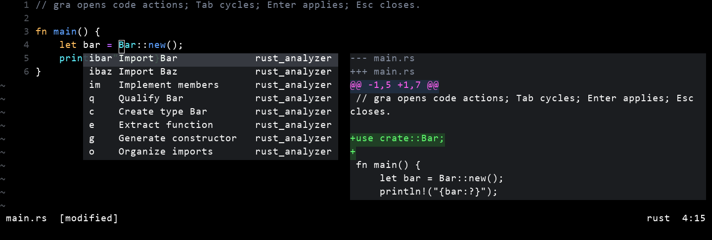

# sub-action.nvim

Blink-style LSP code actions in a Normal-mode submode. Your source buffer keeps
focus; actions and a diff appear beside the cursor.



## Installation

Requires Neovim **0.11+** and an LSP with code actions. With
[lazy.nvim](https://github.com/folke/lazy.nvim):

```lua
{
  "cotrin8672/sub-action.nvim",
  dependencies = {
    {
      "sirasagi62/nvim-submode",
      commit = "b427aef5da3a0ca3edab6ac0da9b66d454e2a52f",
    },
  },
  opts = {},
}
```

Blink is optional. When Blink v2 is loaded, its windows, selection, scrollbar,
highlights, padding, borders, and transparency are reused. Otherwise, native
floats use the same highlight groups. No `nvim-submode.setup()` call is needed.

## Usage

| Key | Action |
| --- | --- |
| `gra` | Open code actions |
| `Tab` / `Shift-Tab` | Next / previous action |
| `Enter` | Apply and leave the submode |
| `Esc` / `Ctrl-C` | Cancel |
| Characters / `Backspace` | Build / shorten a shortcut |

Shortcuts apply as soon as they become unique: `Import Foo`, `Import Bar`, and
`Implement members` become `if`, `ib`, and `im`. Ordinary mappings resume on exit.
Moving or editing the source, switching windows, or leaving Normal mode cancels.

## Configuration

Defaults, also usable without a plugin manager:

```lua
require("sub_action").setup({
  mapping = "gra", -- false for your own mapping
  color = "#E3A875", -- submode accent
  shortcut = { mode = "prefix" }, -- "prefix", "mnemonic", "off"
  ui = {
    action = { max_width = 50, max_height = 8 },
    preview = { max_width = 70, max_height = 15 },
  },
  ranking = { frequency = true },
  client = { display = "name", icons = {} }, -- "name", "icon", "none"
})
```

`.open()` and `.close()` are available. Window options also accept `border`,
`winblend`, and `winhighlight`. The accent is exposed through
`require("nvim-submode").get_submode_color()` for statuslines and cursor colors.

## Performance

Setup loads only the entry point, even without lazy.nvim. Selection reuses the
menu and cached diffs; rapid input coalesces preview work. Actions resolve ahead
of apply, and confirming releases input immediately. Source edits during a
pending resolve cancel that action.

Frequency is kept per filetype, kind, and title. Saves are batched asynchronously
and flushed on normal exit to `stdpath("state")/sub-action.json`.
Concurrent processes use last-writer-wins.

## Development

Set `SUB_ACTION_SUBMODE` to a dependency checkout, or clone it to `.deps/nvim-submode`.
For Blink, also set `SUB_ACTION_BLINK` and `SUB_ACTION_BLINK_LIB`.

```sh
nvim --headless -u NONE -l tests/run.lua
nvim --headless -u NONE -i NONE -l tests/bench.lua
```

Benchmarks report local processing times in µs, excluding LSP transport and
terminal rendering. Set `SUB_ACTION_BENCH_PHASE=setup` to measure startup only.

[MIT](LICENSE).
